# Azure Network Traffic Management Lab

## Overview

This project demonstrates a hands-on Azure networking implementation focused on public traffic distribution and application-aware request routing. The environment was provisioned from an ARM template and extended with a **public Standard Load Balancer** and a **Standard_v2 Application Gateway**.

The implementation was built to validate two core Azure traffic management scenarios:

- **Layer 4 load balancing** using Azure Load Balancer
- **Layer 7 path-based routing** using Azure Application Gateway

This repository is documented for deployment in **(Europe) Switzerland North**.

---

## Project Highlights

- Deployed the base environment from an ARM template
- Provisioned one virtual network, one network security group, and three virtual machines
- Configured a **public Standard Load Balancer** with a static public IP, frontend IP configuration, backend pool, load balancing rule, and health probe
- Configured a **Standard_v2 Application Gateway** in a dedicated subnet with backend pools, listener, backend settings, and path-based routing
- Validated end-to-end connectivity through browser-based testing
- Verified backend health and routing behavior after deployment
- Documented deployment flow, validation results, and troubleshooting notes for portfolio and review purposes

---

## Technologies Used

- Microsoft Azure
- Azure Resource Manager (ARM)
- Azure Virtual Network
- Azure Network Security Group
- Azure Virtual Machines
- Azure Load Balancer (Standard, Public)
- Azure Application Gateway (Standard_v2)
- Azure Portal

---

## Project Information

| Item | Value |
|---|---|
| Project Type | Azure networking lab |
| Region | Switzerland North |
| Resource Group | `az104-rg6` |
| Virtual Network | `az104-06-vnet1` |
| Load Balancer | `az104-lb` |
| Load Balancer Frontend | `az104-fe` |
| Load Balancer Public IP | `az104-lbpip` |
| Load Balancer Backend Pool | `az104-be` |
| Load Balancer Rule | `az104-lbrule` |
| Health Probe | `az104-hp` |
| Application Gateway | `az104-appgw` |
| Application Gateway Public IP | `az104-gwpip` |
| App Gateway Shared Backend | `az104-appgwbe` |
| App Gateway Image Backend | `az104-imagebe` |
| App Gateway Video Backend | `az104-videobe` |
| App Gateway Listener | `az104-listener` |
| App Gateway Rule | `az104-gwrule` |
| Dedicated Gateway Subnet | `subnet-appgw` |
| Gateway Subnet Range | `10.60.3.224/27` |

---

## Architecture

The solution combines Azure Load Balancer and Azure Application Gateway in the same virtual network for lab and learning purposes.

### Core design

- The ARM template provisions the base infrastructure:
  - 1 virtual network
  - 1 network security group
  - 3 virtual machines
- The **public Standard Load Balancer** distributes HTTP traffic across:
  - `az104-06-vm0`
  - `az104-06-vm1`
- The **Application Gateway** is deployed in a dedicated subnet:
  - `subnet-appgw`
  - `10.60.3.224/27`
- The Application Gateway uses separate backend pools for:
  - shared application traffic
  - image requests
  - video requests
- Path-based routing sends:
  - `/image/*` to the image backend
  - `/video/*` to the video backend

### Logical traffic flow

1. The base infrastructure is deployed from ARM template files
2. Public HTTP traffic reaches the Load Balancer frontend IP
3. The Load Balancer distributes traffic across backend virtual machines using a TCP rule and health probe
4. The Application Gateway provides application-aware routing using a dedicated subnet and HTTP listener
5. Requests to `/image/*` are routed to the image backend pool
6. Requests to `/video/*` are routed to the video backend pool
7. Backend health is validated from the Application Gateway monitoring view

## Architecture

This lab demonstrates Azure traffic management using two core services:

- **Azure Load Balancer** for Layer 4 traffic distribution
- **Azure Application Gateway** for Layer 7 application-aware routing

The environment was deployed in **Switzerland North** and validated through backend health checks, public endpoint testing, and path-based routing verification.

### Technical Diagrams

#### 1) Azure Load Balancer Flow Diagram

[View Diagram](./diagrams/azure-load-balancer-flow-diagram.png)

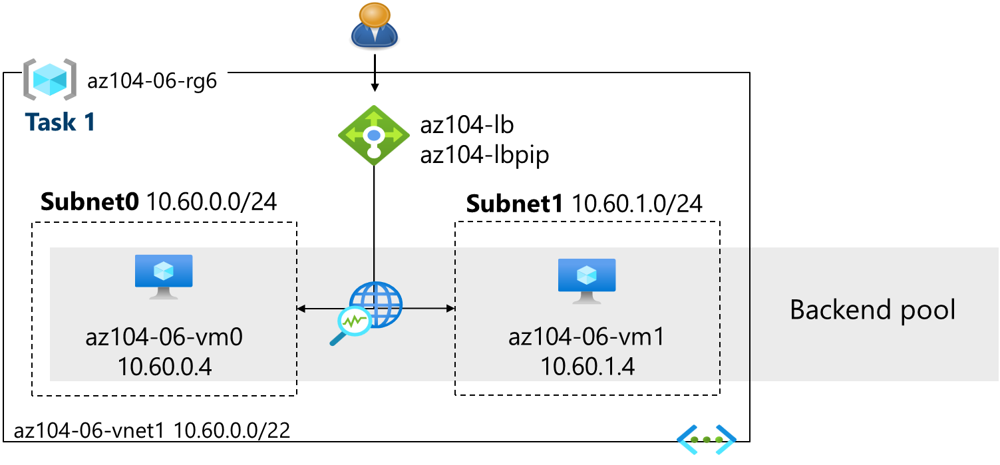

#### 2) Azure Application Gateway Routing Diagram

[View Diagram](./diagrams/azure-application-gateway-routing-diagram.png)

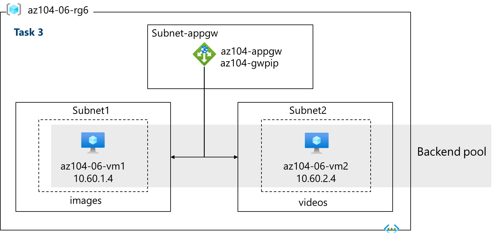

### Architecture Notes

- The base infrastructure is deployed using ARM templates
- The virtual network hosts the backend virtual machines and the dedicated Application Gateway subnet
- The public Standard Load Balancer distributes HTTP traffic across backend virtual machines
- The Standard_v2 Application Gateway provides Layer 7 routing and path-based request forwarding
- Requests to `/image/*` are routed to the image backend
- Requests to `/video/*` are routed to the video backend

---

## Screenshots

### 1) ARM Template Deployment

#### Custom template deployment
[View Image](./screenshots/01-custom-template-deployment.png)

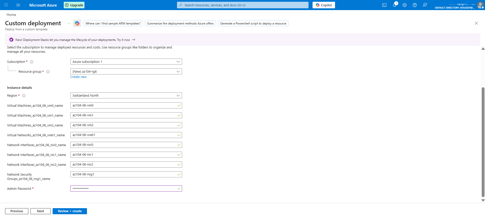

---

### 2) Resource Group Overview

#### Resource group resources after deployment
[View Image](./screenshots/02-resource-group-overview.png)

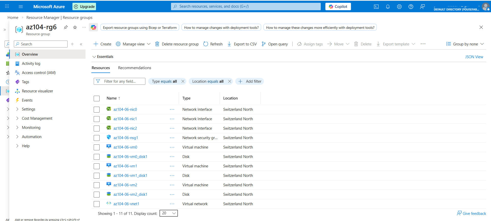

---

### 3) Virtual Network Overview

#### Virtual network overview
[View Image](./screenshots/03-vnet-overview.png)

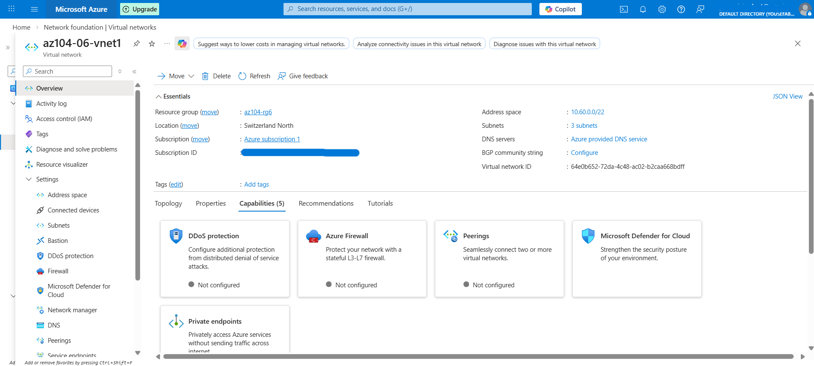

#### Virtual network subnets overview
[View Image](./screenshots/04-vnet-subnets-overview.png)

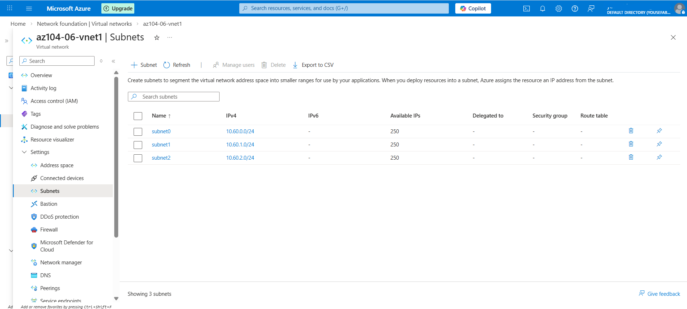

---

### 4) Azure Load Balancer Configuration

#### Load Balancer overview
[View Image](./screenshots/05-load-balancer-overview.png)

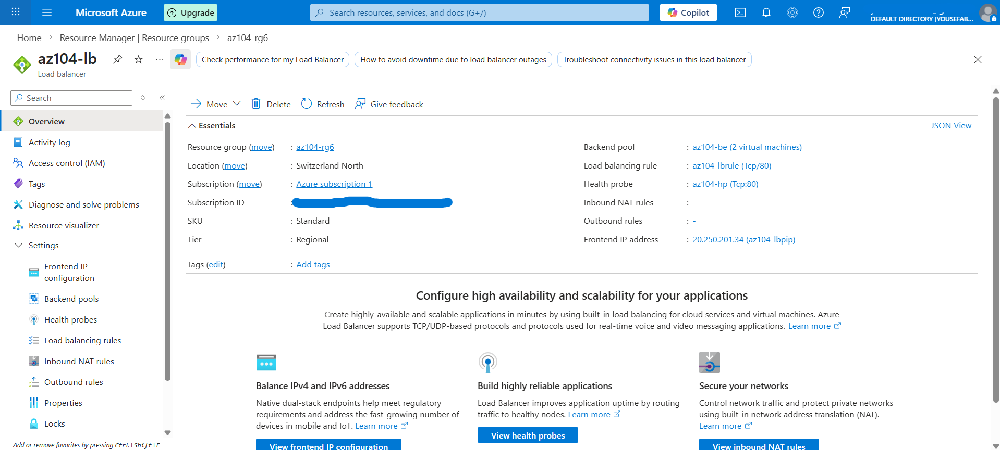

#### Load Balancer backend pool
[View Image](./screenshots/06-load-balancer-backend-pool.png)

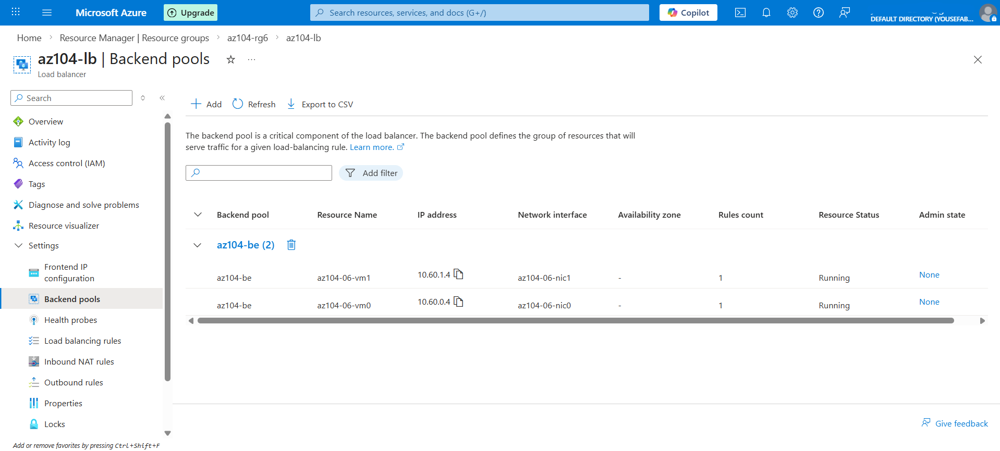

#### Load Balancer rule and health probe
[View Image](./screenshots/07-load-balancer-rule-health-probe.png)

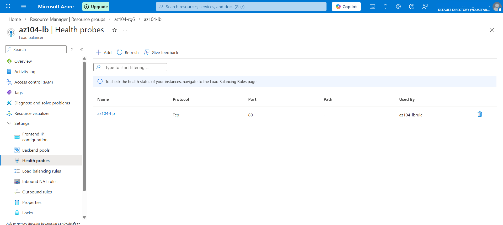

#### Load Balancer validation - VM0 response
[View Image](./screenshots/08-load-balancer-validation-vm0.png)

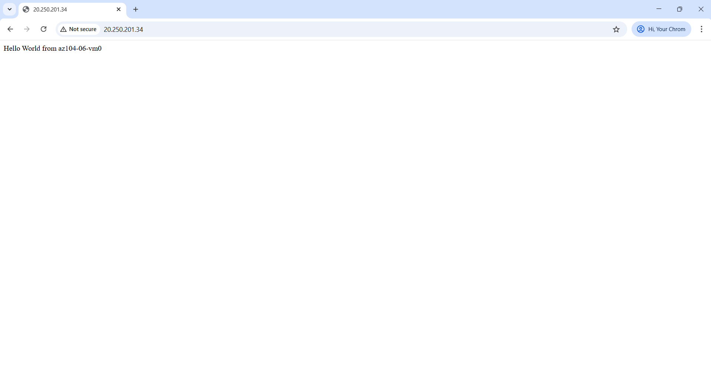

#### Load Balancer validation - VM1 response
[View Image](./screenshots/09-load-balancer-validation-vm1.png)

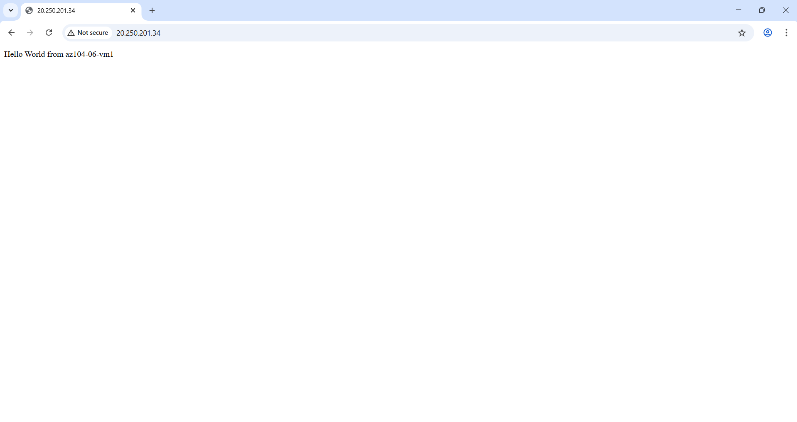

---

### 5) Azure Application Gateway Configuration

#### Application Gateway overview
[View Image](./screenshots/10-app-gateway-overview.png)

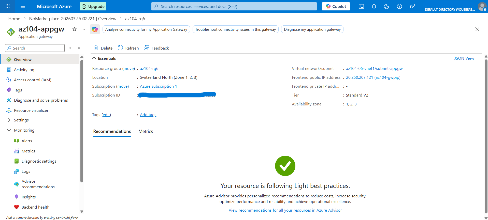

#### Application Gateway backend pools
[View Image](./screenshots/11-app-gateway-backend-pools.png)

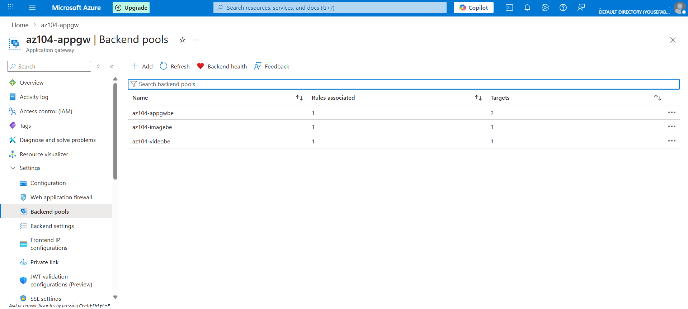

#### Application Gateway routing rules
[View Image](./screenshots/12-app-gateway-routing-rules.png)

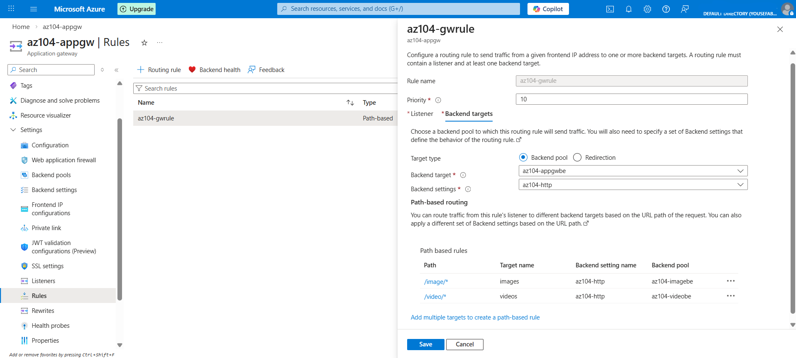

#### Application Gateway backend health
[View Image](./screenshots/13-app-gateway-backend-health.png)

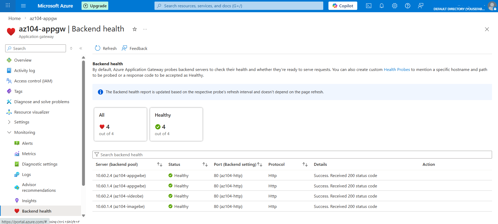

---

### 6) Path-Based Routing Validation

#### Image path routing test
[View Image](./screenshots/14-app-gateway-image-routing-test.png)


#### Video path routing test
[View Image](./screenshots/15-app-gateway-video-routing-test.png)

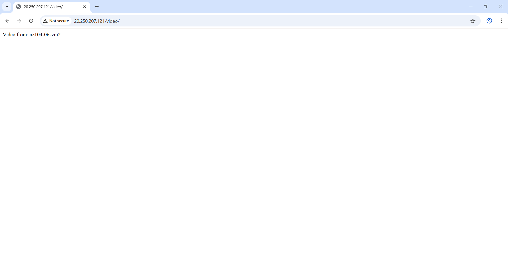

---

## Project Structure

```text
azure-network-traffic-management-lab/
├── README.md
├── LICENSE
├── templates/
│   ├── az104-06-vms-template.json
│   └── az104-06-vms-parameters.json
├── screenshots/
│   ├── 01-custom-template-deployment.png
│   ├── 02-resource-group-overview.png
│   ├── 03-vnet-overview.png
│   ├── 04-vnet-subnets-overview.png
│   ├── 05-load-balancer-overview.png
│   ├── 06-load-balancer-backend-pool.png
│   ├── 07-load-balancer-rule-health-probe.png
│   ├── 08-load-balancer-validation-vm0.png
│   ├── 09-load-balancer-validation-vm1.png
│   ├── 10-app-gateway-overview.png
│   ├── 11-app-gateway-backend-pools.png
│   ├── 12-app-gateway-routing-rules.png
│   ├── 13-app-gateway-backend-health.png
│   ├── 14-app-gateway-image-routing-test.png
│   └── 15-app-gateway-video-routing-test.png
├── diagrams/
│   └── azure-network-traffic-management-architecture.png
└── docs/
    ├── deployment-notes.md
    ├── validation-results.md
    └── troubleshooting-notes.md
```

---

## Deployment Steps

## 1) Prepare the repository files

Before publishing the repository, place the following files in the correct locations:

- `templates/az104-06-vms-template.json`
- `templates/az104-06-vms-parameters.json`
- screenshots inside `screenshots/`
- architecture diagram inside `diagrams/`
- supporting notes inside `docs/`

---

## 2) Review region and deployment values

Before deployment, verify that the template or parameter file does not still reference another region.

### Check the following

- Deployment region is set to **Switzerland North**
- Resource group is `az104-rg6`
- VM sizing is supported in the selected region and subscription
- If the original size is unavailable, use a supported alternative that satisfies the lab requirements

---

## 3) Deploy the base infrastructure from ARM template

### Azure portal workflow

1. Sign in to the Azure portal
2. Search for **Deploy a custom template**
3. Select **Build your own template in the editor**
4. Select **Load file**
5. Upload `templates/az104-06-vms-template.json`
6. Select **Save**
7. Select **Edit parameters**
8. Load `templates/az104-06-vms-parameters.json`
9. Select **Save**
10. Complete the deployment form:
    - **Resource group:** `az104-rg6`
    - **Region:** `Switzerland North`
    - **Password:** secure local administrator password
11. Select **Review + create**
12. Select **Create**

### Expected deployment result

The base deployment should create:

- one virtual network
- one network security group
- three virtual machines

---

## 4) Configure the Azure Load Balancer

### Create the Load Balancer

1. Search for **Load balancers** in the Azure portal
2. Select **Create**
3. Use these values:

| Setting | Value |
|---|---|
| Name | `az104-lb` |
| Region | `Switzerland North` |
| SKU | `Standard` |
| Type | `Public` |
| Tier | `Regional` |

### Configure the frontend IP

| Setting | Value |
|---|---|
| Name | `az104-fe` |
| IP type | `IP address` |
| Gateway Load Balancer | `None` |
| Public IP address | `Create new` |

Public IP configuration:

| Setting | Value |
|---|---|
| Name | `az104-lbpip` |
| SKU | `Standard` |
| Tier | `Regional` |
| Assignment | `Static` |
| Routing Preference | `Microsoft network` |

### Configure the backend pool

| Setting | Value |
|---|---|
| Name | `az104-be` |
| Virtual network | `az104-06-vnet1` |
| Backend Pool Configuration | `NIC` |

Backend members:

- `az104-06-vm0`
- `az104-06-vm1`

### Create the load balancing rule and health probe

| Setting | Value |
|---|---|
| Rule name | `az104-lbrule` |
| IP Version | `IPv4` |
| Frontend IP | `az104-fe` |
| Backend pool | `az104-be` |
| Protocol | `TCP` |
| Frontend port | `80` |
| Backend port | `80` |
| Session persistence | `None` |
| Idle timeout | `4` |
| TCP reset | `Disabled` |
| Floating IP | `Disabled` |
| Outbound SNAT | `Recommended` |

Health probe:

| Setting | Value |
|---|---|
| Name | `az104-hp` |
| Protocol | `TCP` |
| Port | `80` |
| Interval | `5` |

---

## 5) Validate the Load Balancer

1. Open the Load Balancer resource
2. Copy the frontend public IP address
3. Open the public IP in a browser
4. Verify the page displays either:
   - `Hello World from az104-06-vm0`
   - or `Hello World from az104-06-vm1`
5. Refresh the page multiple times
6. Confirm the response rotates between backend virtual machines

### Validation objective

This confirms:

- frontend reachability
- backend pool association
- rule functionality
- health probe participation
- traffic distribution behavior

---

## 6) Create the Application Gateway subnet

Before creating the Application Gateway, add a dedicated subnet to the virtual network.

1. Open `az104-06-vnet1`
2. Go to **Subnets**
3. Select **+ Subnet**
4. Configure:

| Setting | Value |
|---|---|
| Name | `subnet-appgw` |
| Starting address | `10.60.3.224` |
| Size | `/27` |

---

## 7) Configure the Application Gateway

### Create the gateway

1. Search for **Application gateways**
2. Select **Create**
3. On the **Basics** tab, use:

| Setting | Value |
|---|---|
| Name | `az104-appgw` |
| Region | `Switzerland North` |
| Tier | `Standard_v2` |
| Enable autoscaling | `No` |
| Instance count | `2` |
| HTTP2 | `Disabled` |
| Virtual network | `az104-06-vnet1` |
| Subnet | `subnet-appgw (10.60.3.224/27)` |

### Configure the frontend

| Setting | Value |
|---|---|
| Frontend IP address type | `Public` |
| Public IP address | `Add new` |
| Name | `az104-gwpip` |

### Configure backend pools

#### Shared backend pool
| Setting | Value |
|---|---|
| Name | `az104-appgwbe` |
| Targets | `az104-06-nic1 (10.60.1.4)`, `az104-06-nic2 (10.60.2.4)` |

#### Image backend pool
| Setting | Value |
|---|---|
| Name | `az104-imagebe` |
| Targets | `az104-06-nic1 (10.60.1.4)` |

#### Video backend pool
| Setting | Value |
|---|---|
| Name | `az104-videobe` |
| Targets | `az104-06-nic2 (10.60.2.4)` |

### Configure the listener and routing rule

| Setting | Value |
|---|---|
| Rule name | `az104-gwrule` |
| Priority | `10` |
| Listener name | `az104-listener` |
| Frontend IP | `Public IPv4` |
| Protocol | `HTTP` |
| Port | `80` |
| Listener type | `Basic` |
| Backend settings | `az104-http` |

### Configure path-based routing

#### Image path rule
| Setting | Value |
|---|---|
| Path | `/image/*` |
| Target name | `images` |
| Backend settings | `az104-http` |
| Backend target | `az104-imagebe` |

#### Video path rule
| Setting | Value |
|---|---|
| Path | `/video/*` |
| Target name | `videos` |
| Backend settings | `az104-http` |
| Backend target | `az104-videobe` |

---

## 8) Validate the Application Gateway

### Backend health validation

1. Open `az104-appgw`
2. Go to **Backend health**
3. Confirm the backend servers show **Healthy**

### Route validation

1. Copy the frontend public IP address
2. Test:
   - `http://<frontend-ip>/image/`
   - `http://<frontend-ip>/video/`
3. Confirm:
   - `/image/` routes to the image backend
   - `/video/` routes to the video backend

### Validation objective

This confirms:

- listener functionality
- backend target association
- routing rule correctness
- path-based routing behavior
- backend health visibility

---

## Security Implementation

This project includes baseline security-aware design choices while keeping the documentation aligned to what was actually implemented.

### Implemented security-related controls

- **Network Security Group deployed with the base environment**
  - provides foundational network-level access control within the lab environment
- **Standard SKU public Load Balancer**
  - uses the production-grade Azure load balancing tier instead of Basic
- **Dedicated Application Gateway subnet**
  - isolates gateway placement from general workload subnet allocation
- **Backend health monitoring**
  - supports routing decisions based on backend availability and responsiveness
- **Explicit backend association**
  - traffic is directed only to defined backend members in the configured pools
- **Path-based traffic separation**
  - application traffic is segmented by URL path for controlled backend targeting

### Not implemented in this version

- HTTPS listener configuration
- SSL termination
- end-to-end TLS encryption
- WAF policy
- custom hardening beyond the documented lab configuration

The goal of this repository is to present an accurate implementation record rather than overstate the security scope.

---

## Key Learning Outcomes

- Understood the difference between **Layer 4** and **Layer 7** traffic management in Azure
- Practiced deploying infrastructure from **ARM templates**
- Configured a public Standard Load Balancer with a static public IP, backend pool, TCP rule, and health probe
- Configured a Standard_v2 Application Gateway with listener, backend pools, backend settings, and path-based routing
- Validated frontend access, backend rotation, backend health, and route-specific behavior
- Strengthened practical understanding of Azure networking, traffic flow, service placement, and post-deployment validation

---

## Why This Project Matters

This project demonstrates more than resource creation. It shows the ability to:

- deploy Azure infrastructure from reusable templates
- implement and compare two different Azure traffic management services
- associate backends correctly and validate routing outcomes
- verify connectivity through practical testing rather than assumption
- document architecture, deployment decisions, and operational checks in a structured way

From a portfolio perspective, this project is valuable because it reflects implementation discipline, validation mindset, and technical clarity. It presents the work as an engineering exercise with measurable outcomes, not just a portal walkthrough.

---

## Additional Documentation

- [Deployment Notes](./docs/deployment-notes.md)
- [Validation Results](./docs/validation-results.md)
- [Troubleshooting Notes](./docs/troubleshooting-notes.md)

---

## Author

**Yousef**

Cloud / Infrastructure / Azure Administration

---

## Notes

- This repository is documented for **Switzerland North**
- The original lab guidance may reference another region, so region values should be verified before deployment
- This project was implemented as a lab and portfolio exercise, not as a production architecture blueprint
- The Application Gateway and Load Balancer were placed in the same virtual network for learning purposes
- In constrained personal lab environments, available VM sizes and core quotas may vary by subscription type and region
- If you are using a free or limited lab account, verify regional SKU availability before deployment planning
- In this project context, resource sizing decisions were influenced by a constrained lab quota and the need to distribute available compute across three virtual machines
